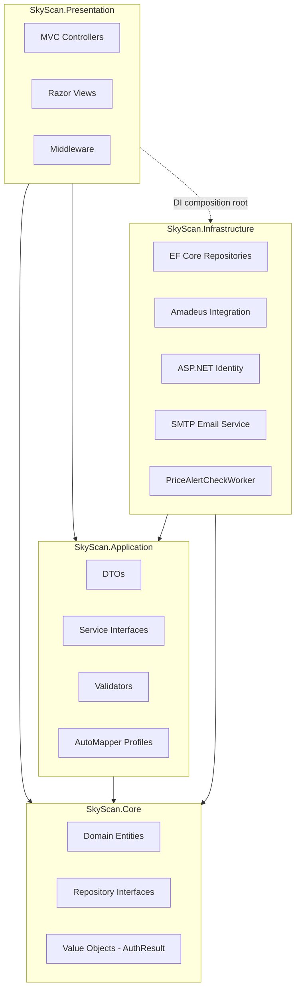
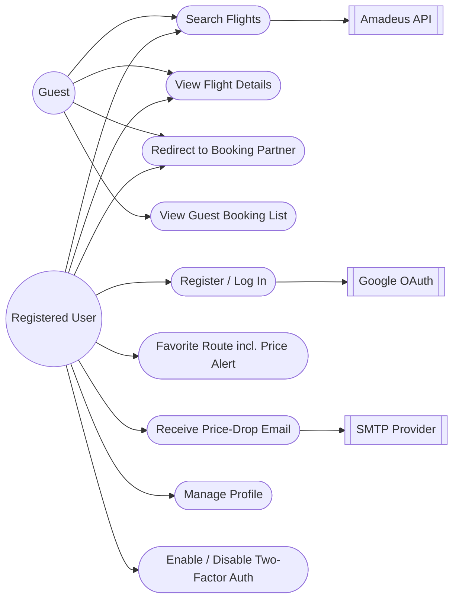
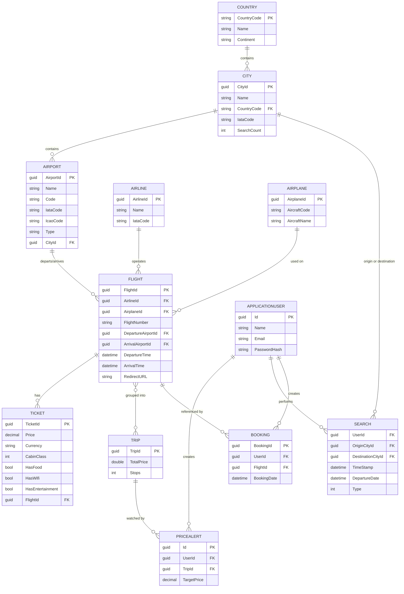
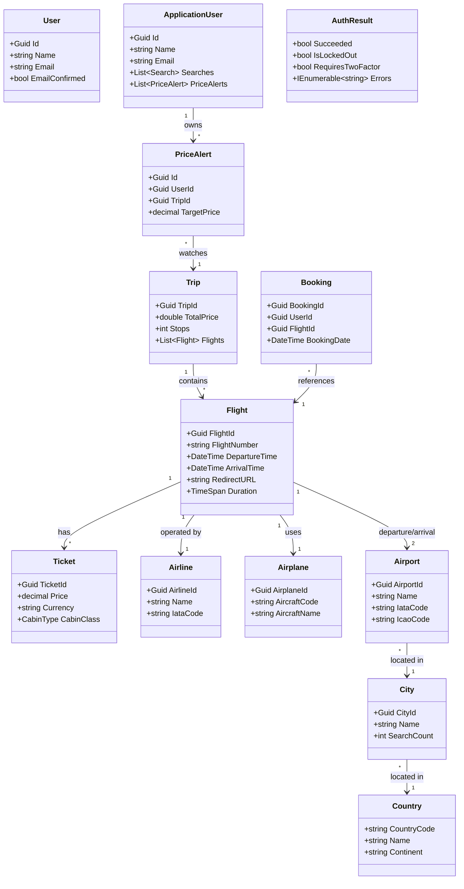
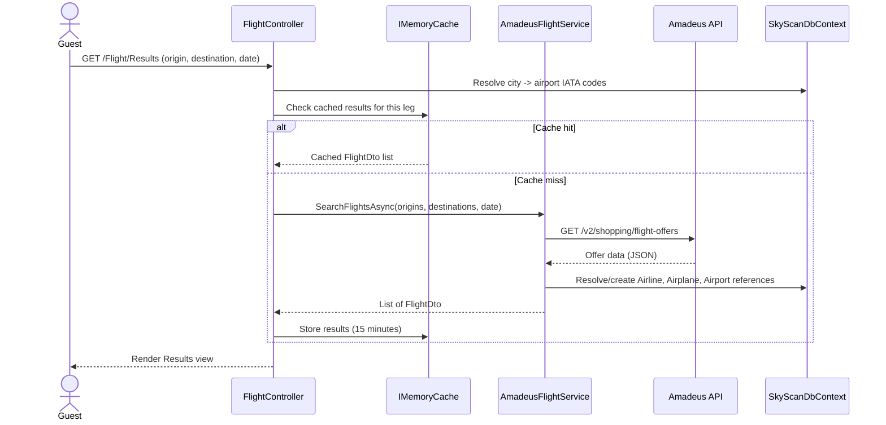
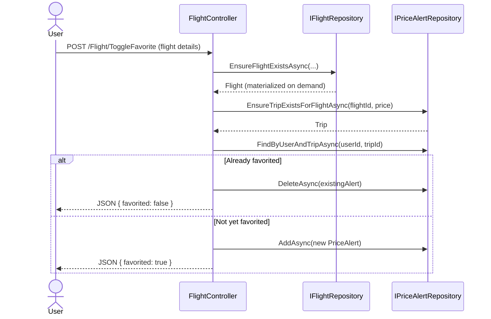
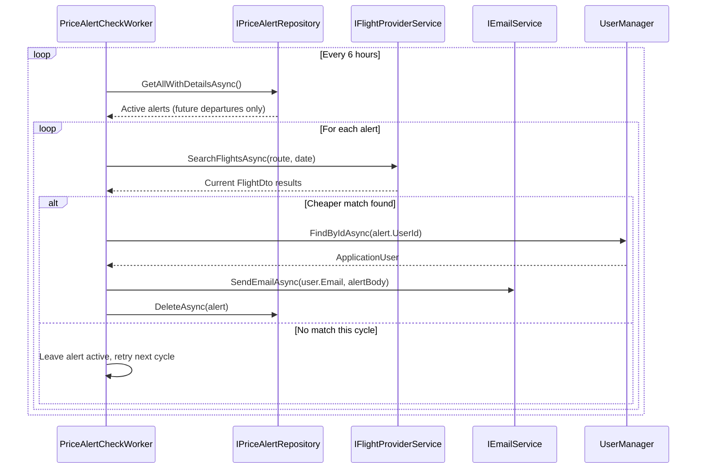

# SkyScan — Design Document

**Companion to:** `SkyScan_Project_Report.md`
**Status:** Draft — content-complete, pending conversion to formal .docx template
**Diagram notation:** Mermaid (renders natively in GitHub, VS Code, Obsidian; convert to images when embedding in Word)

---

## Table of Contents

1. Purpose of This Document
2. Architectural Overview
3. Use Case Diagram
4. Database Design (ER Diagram + Data Dictionary)
5. Domain Class Diagram
6. Sequence Diagrams
7. Design Decisions & Rationale
8. Security Design
9. Glossary

---

## 1. Purpose of This Document

This document provides the structural and behavioral design views that support the Project Report: the layered architecture, the use-case model, the database schema, the domain class model, and the interaction sequences for SkyScan's three core flows (searching, favoriting/redirect, and automated price checking).

## 2. Architectural Overview

SkyScan follows Clean Architecture with strict inward dependency direction — outer layers depend on inner layers, never the reverse.

**Reading this diagram:** Core has no outgoing dependencies on any other layer — it is pure C# with no EF Core, no ASP.NET, no HTTP concerns. Infrastructure implements the interfaces Core defines. Presentation only ever talks to Core/Application abstractions directly in code; the concrete Infrastructure implementations are wired in once, at startup, via dependency injection (the dashed line).

## 3. Use Case Diagram

Mermaid has no native UML use-case notation, so actors and use cases are modeled as a bipartite graph (actor → use case).

## 4. Database Design

### 4.1 Entity-Relationship Diagram

Note: `APPLICATIONUSER` is the Identity-backed table (`AspNetUsers`), mapped in code by `Infrastructure.Identity.ApplicationUser`. `Search`, `PriceAlert`, and `Booking` reference it by `UserId` (a foreign key only) rather than holding a full navigation property in the Core-layer entity, which keeps Core free of any Identity dependency.

### 4.2 Data Dictionary

**Country**

| Field | Type | Constraints |
|---|---|---|
| CountryCode | string | PK, exactly 2 chars (ISO alpha-2) |
| Name | string | Required, max 100 |
| Continent | string | Max 10 |

**City**

| Field | Type | Constraints |
|---|---|---|
| CityId | Guid | PK |
| Name | string | Required, max 100 |
| CountryCode | string | Required, FK → Country |
| IataCode | string? | Max 3 |
| SearchCount | int | Default 0; incremented per search, drives trending routes |

**Airport**

| Field | Type | Constraints |
|---|---|---|
| AirportId | Guid | PK |
| Name | string | Required, max 100 |
| Code | string | Required, max 10 |
| IataCode | string? | Exactly 3 chars |
| IcaoCode | string? | Exactly 4 chars |
| Type | string? | Max 50 |
| CityId | Guid | Required, FK → City |

**Airline** *(static reference data — lazily populated)*

| Field | Type | Constraints |
|---|---|---|
| AirlineId | Guid | PK |
| Name | string | Required, max 100 |
| IataCode | string? | 2–3 chars |

**Airplane** *(static reference data — lazily populated)*

| Field | Type | Constraints |
|---|---|---|
| AirplaneId | Guid | PK |
| AircraftCode | string | Required, max 10 |
| AircraftName | string? | Max 150 |

**Flight**

| Field | Type | Constraints |
|---|---|---|
| FlightId | Guid | PK |
| AirlineId | Guid | Required, FK → Airline |
| AirplaneId | Guid | Required, FK → Airplane |
| FlightNumber | string | Required, max 20 |
| DepartureAirportId | Guid | Required, FK → Airport |
| ArrivalAirportId | Guid | Required, FK → Airport |
| DepartureTime | DateTime | Required |
| ArrivalTime | DateTime | Required |
| RedirectURL | string | Valid URL; destination the user is sent to for booking |

`Duration` is a computed property (`ArrivalTime − DepartureTime`), not a stored column.

**Ticket**

| Field | Type | Constraints |
|---|---|---|
| TicketId | Guid | PK |
| Price | decimal(18,2) | Required, 0.01–1,000,000 |
| Currency | string? | Max 3 (ISO currency code) |
| CabinClass | enum (CabinType) | Required |
| HasFood / HasWifi / HasEntertainment | bool | Default false |
| FlightId | Guid | Required, FK → Flight |

**Trip**

| Field | Type | Constraints |
|---|---|---|
| TripId | Guid | PK |
| TotalPrice | double | Default 0 *(flagged for a future decimal conversion — see fix plan)* |
| Stops | int | |
| Flights | collection | One or more Flight entities grouped as this trip |

**PriceAlert**

| Field | Type | Constraints |
|---|---|---|
| Id | Guid | PK |
| UserId | Guid | Required, FK → ApplicationUser (FK-only, no Core nav property) |
| TripId | Guid | Required, FK → Trip |
| TargetPrice | decimal(18,2) | Required, 0–1,000,000 |

**Booking**

| Field | Type | Constraints |
|---|---|---|
| BookingId | Guid | PK |
| UserId | Guid | Required |
| FlightId | Guid | Required, FK → Flight |
| BookingDate | DateTime | Defaults to creation time (UTC) |

**Search**

| Field | Type | Constraints |
|---|---|---|
| TimeStamp | DateTime | |
| Type | enum (TripType) | OneWay / RoundTrip / MultiWay |
| DepartureDate | DateTime | |
| OriginCityId / DestinationCityId | Guid | FK → City |
| UserId | Guid | |

## 5. Domain Class Diagram

`User` and `ApplicationUser` are intentionally not linked by inheritance in the class model — they're bridged by extension methods (`ToDomain()`, `ToAuthResult()`), not a shared base class, to keep `User` free of any Identity dependency.

## 6. Sequence Diagrams

### 6.1 Flight Search

### 6.2 Favorite a Flight (Price Alert Creation)

### 6.3 Automated Price-Alert Check (Background Worker)

## 7. Design Decisions & Rationale

**Repository pattern over direct DbContext access.** Every entity is accessed through a Core-defined interface (e.g., `IFlightRepository`), implemented in Infrastructure. This keeps controllers and application logic decoupled from EF Core specifics and makes the persistence layer swappable/testable in isolation.

**Lazy, static-only persistence from search results.** Only Airline and Airplane reference data are written to the database as a byproduct of a search; Flight/Trip rows are materialized on demand, not on every search. This was a deliberate correction from an earlier design that wrote a Flight/Ticket row per search result, which would have caused unbounded database growth with no corresponding value (most search results are never revisited).

**Domain/Identity separation (`User` vs `ApplicationUser`).** Core must have zero framework dependencies, but authentication needs a production-grade Identity system. The two concerns are reconciled by keeping `Core.Entities.User` as a plain POCO and moving all Identity-specific behavior into `Infrastructure.Identity.ApplicationUser`, connected by mapping extension methods and a Core-owned `AuthResult` value object in place of `IdentityResult`/`SignInResult`.

**One-shot price alerts.** Rather than tracking "already notified" state, an alert is simply deleted once it successfully fires. This keeps the `PriceAlert` schema minimal and avoids an extra status column, at the cost of the user needing to re-favorite a route if they want to keep watching it after a notification.

**Trip as the price-alert unit, not Flight directly.** A `PriceAlert` targets a `Trip` (which groups one or more Flights) rather than a bare Flight, so the same modeling primitive supports both one-way and (future) multi-leg alerts without a schema change later.

## 8. Security Design

- **Password handling:** delegated entirely to ASP.NET Core Identity's built-in hashing (PBKDF2) — SkyScan code never handles or stores raw passwords.
- **Cookies:** the guest "my bookings" cookie is explicitly set `HttpOnly` and `Secure`. The main authentication cookie's global policy (`HttpOnly`/`Secure`/`SameSite`) is not yet explicitly configured at the application level — tracked as an open item in the current-issues fix plan.
- **Two-factor authentication:** supported for registered users via ASP.NET Core Identity's standard TOTP flow.
- **Third-party auth:** Google OAuth is used for social login rather than SkyScan handling third-party credentials directly.
- **Secrets management:** at present, API keys and credentials (Amadeus, SMTP, Google OAuth, database connection string) are stored in `appsettings.json`, which is a known hygiene gap — the fix plan recommends moving these to user secrets (development) or a secrets manager/environment variables (deployed) rather than committing them to source control.
- **External API resilience:** the Amadeus integration currently has no retry/timeout policy — a transient failure in the external API can surface as a failed search rather than being retried automatically; a resilience library (e.g., Polly) is recommended as a near-term hardening step.

## 9. Glossary

| Term | Meaning |
|---|---|
| GDS | Global Distribution System — the type of system Amadeus is; aggregates airline inventory for search/booking. |
| OTA | Online Travel Agency — a third-party booking site (e.g., Kiwi.com) SkyScan may redirect users to. |
| IATA code | 3-letter airport code (e.g., `JFK`) or 2-letter airline code, standardized by the International Air Transport Association. |
| ICAO code | 4-letter airport/aircraft code, standardized by the International Civil Aviation Organization. |
| PNR | Passenger Name Record — a confirmed airline/OTA booking reference. SkyScan does not issue these. |
| CQRS | Command Query Responsibility Segregation — an architectural pattern (planned, not yet implemented) separating read and write operations. |
| DTO | Data Transfer Object — a plain object shaping data between layers, distinct from a domain entity. |
